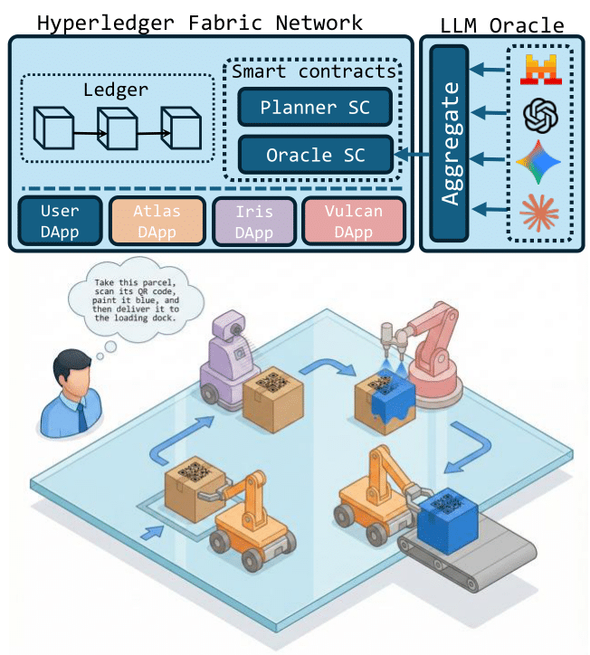

<p align="center">
  
</p>

# A Multi-Robot Task Planner with LLM Oracles
This repository have the codes for our experiments analyzing and evaluating LLM Oracles for the purpose of multi-robot task planning.

## Prerequisites

- Python 3.9+ with a virtual environment (recommended).
- An OpenRouter API key (set in the environment as `OPENROUTER_API_KEY`).
- Tested on Ubuntu 24.04.3 LTS.

Example environment setup:

- Create and activate a virtual environment.
- Install dependencies listed in requirements.txt file.

```pip install -r requirements.txt```

- Export your OpenRouter key in the shell before running any scripts.

## Data Layout

- Task definitions are stored in [tasks.csv](tasks.csv). This file contains 30 tasks and their decompositions.
- The list of robots and their skills is stored in [PROMPT.txt](PROMPT.txt).
- Model lists (for batch runs) can be kept in [models.txt](models.txt).

## How to Use the Python Scripts

### [benchmark.py](benchmark.py)

Purpose: Run the main benchmark pipeline across tasks and models.

What it does:
- Loads tasks from [tasks.csv](tasks.csv).
- Uses prompts from [PROMPT.txt](PROMPT.txt).
- Queries models (via OpenRouter) and stores outputs in model-specific CSV files.

How to store outputs:
- Place results in a dedicated folder (e.g., [outputs/](outputs/), [outputs_malicious/](outputs_malicious/), or a custom run folder such as [T1-claude/](T1-claude/)).
- Each model produces a file like `llm_<model>.csv` in the chosen output folder.

How to generate outputs:
- Run the script with your configured environment and OpenRouter key.
- Verify that the output folder contains new `llm_*.csv` files after the run completes.

### [similarity.py](similarity.py)

Purpose: Compute similarity metrics between model outputs and ground-truth decompositions.

What it does:
- Reads the model output CSVs (e.g., from [outputs/](outputs/)).
- Computes similarity scores and writes a summary CSV such as `similarity.csv`.

How to store outputs:
- Place similarity summaries in the same folder as the model outputs (e.g., [outputs/](outputs/)) or in a dedicated evaluation folder.

How to generate outputs:
- Run after you have model output CSVs.
- Confirm that `similarity.csv` (or similarly named file) appears in the output folder.

### [pairwise_similarity.py](pairwise_similarity.py)

Purpose: Compute pairwise similarity between model responses or task outputs.

What it does:
- Reads model output CSVs for each task.
- Produces per-task pairwise similarity tables (TSV/CSV).

How to store outputs:
- Use a dedicated subfolder, such as [outputs/pairwise_similarity/](outputs/pairwise_similarity/).

How to generate outputs:
- Run after model outputs are available.
- Verify that per-task files (e.g., `task_1_pairwise_similarity.tsv`) are created.


### [figures/accuracy.py](figures/accuracy.py)

Purpose: Generate accuracy plots from similarity summaries.

How to store outputs:
- Store figures in [figures/](figures/) or a dedicated `figures/` subfolder per run.

How to generate outputs:
- Run after similarity summaries exist.
- Check for new image files in [figures/](figures/).

### [figures/latency.py](figures/latency.py)

Purpose: Generate latency plots from benchmark results.

How to store outputs:
- Store figures in [figures/](figures/).

How to generate outputs:
- Run after benchmark outputs exist with timing data.
- Check for new image files in [figures/](figures/).

### [figures/reputation.py](figures/reputation.py)

Purpose: Generate reputation or quality plots for model outputs.

How to store outputs:
- Store figures in [figures/](figures/).

How to generate outputs:
- Run after similarity summaries exist.
- Check for new image files in [figures/](figures/).

### [figures/task_pairwise_heatmaps.py](figures/task_pairwise_heatmaps.py)

Purpose: Create per-task pairwise similarity heatmaps.

How to store outputs:
- Store heatmap images in [figures/](figures/) or a per-run figures folder.

How to generate outputs:
- Run after pairwise similarity TSV/CSV files exist.
- Confirm heatmap images are generated.


## SkillChain-RTC benchmark

The task catalog is in [tasks.csv](tasks.csv) and contains 30 tasks with their decompositions. The list of robots and their skills is also available in [PROMPT.txt](PROMPT.txt).
